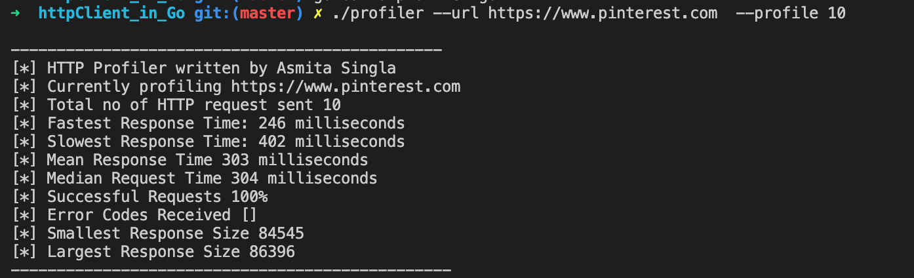
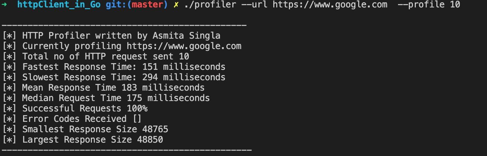
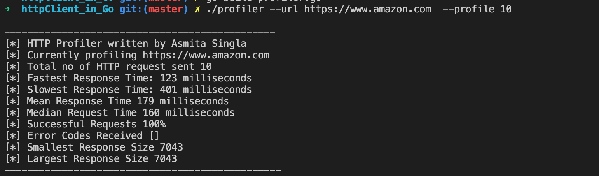

# cloudflare 2020 systems engineering assignment

## 1. Use of language

I attempted to implement this project using GO. This is the first time I have ever used GO and it was an interesting experience. Also I am not a systems engineer so this assignment was quiet a challenge to me. 
Install GO to build the tool.

## 2. Build tool using following steps

1. Build: $ go build profiler.go
2. Run: $ ./profiler --url [url] --profile [no. of requests]
3. To print the json output of links do not use --profile flag: $ ./profiler --url [url]

## 3. About

* I could have used threading to make the profiling go a bit faster but I did not want to add overhead, which could pollute the profiling data. Also, because I am new at GO I decided not to do it.

* The tool would only work on valid TLS endpoints

* For simplicity I consider every http response which is not 200 as a failure.

## 4. Observations

(All observations are made on 10 request iterations)
The mean response time for amazon and google was in a close range of 170-180 ms range. The worker project URL was faster and came around 130 ms. Pinterest was slower with mean response time of 303 ms.
Reddit was the slowest with mean response time of 3737 ms. 

## Screenshots

Links_JSON_output:

Links_Profiler:

Reddit_profiler:

Pinterest_profiler:

Google_Profiler:

Amazon_Profiler:

